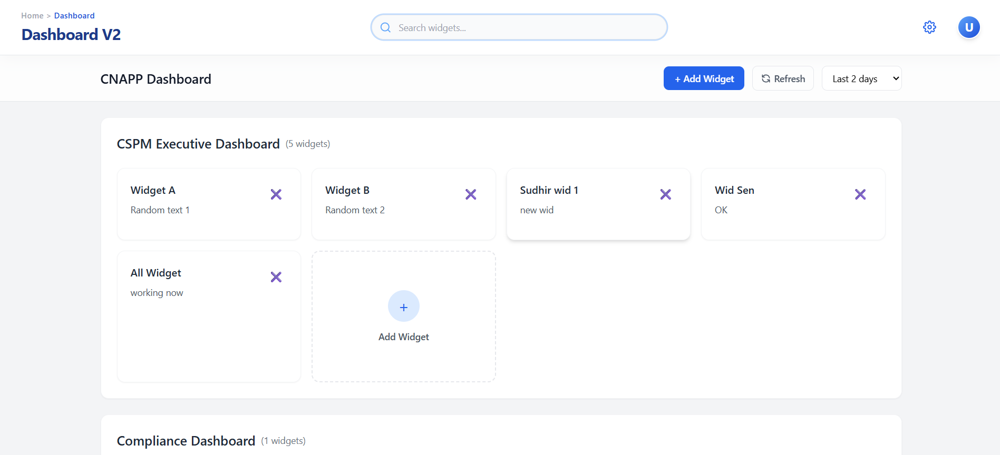
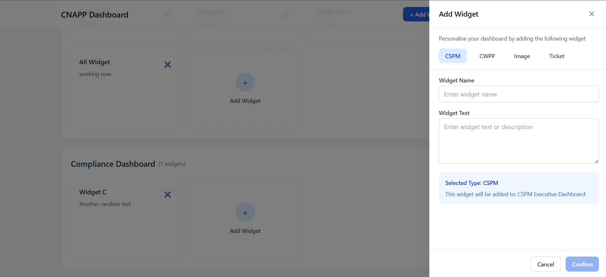

# Dashboard Widget Management Application

A modern React-based dashboard application that allows users to manage and organize widgets across different categories. Built with React, Redux Toolkit, Tailwind CSS, and Vite.

## Screenshots

### Dashboard Interface


### Add Widget Modal


## Features

- 💠 Dynamic widget management system
- 🔍 Real-time search functionality
- 📱 Responsive design for all screen sizes
- ➕ Add custom widgets to categories
- 🗑️ Remove widgets from categories
- 🎯 Category-based organization
- 🎨 Modern and clean UI with Tailwind CSS

## Prerequisites

Before you begin, ensure you have the following installed:
- Node.js (version 14.0 or higher)
- npm (Node Package Manager)

## How to Run Locally

1. **Clone the Repository**
   ```bash
   git clone <repository-url>
   cd acc_asg
   ```

2. **Install Dependencies**
   ```bash
   npm install
   ```
   This will install:
   - React and React DOM
   - Redux Toolkit for state management
   - Tailwind CSS for styling
   - React Icons for icons
   - Vite for development server and building

3. **Start the Development Server**
   ```bash
   npm run dev
   ```
   The application will be available at `http://localhost:5173`

4. **Build for Production** (Optional)
   ```bash
   npm run build
   ```

## Usage Guide

### Adding a Widget
1. Click the "+ Add Widget" button in the top navigation bar
2. Select a widget type (CSPM, CWPP, Image, or Ticket)
3. Enter the widget name (required)
4. Enter widget text/description (optional)
5. Click "Confirm" to add the widget

### Removing a Widget
1. Locate the widget you want to remove
2. Click the "✖" button in the top-right corner of the widget
3. The widget will be immediately removed from the category

### Searching Widgets
1. Use the search bar in the header
2. Type your search query
3. Widgets will be filtered in real-time across all categories

## Project Structure

```
acc_asg/
├── src/
│   ├── components/           # React components
│   │   ├── AddWidgetModal.jsx
│   │   ├── Category.jsx
│   │   ├── Dashboard.jsx
│   │   ├── Header.jsx
│   │   ├── SearchBar.jsx
│   │   └── Widget.jsx
│   ├── store/               # Redux store
│   │   ├── dashboardSlice.js
│   │   └── store.js
│   ├── data/               # Initial data
│   │   └── initialData.json
│   ├── App.jsx            # Main application component
│   └── main.jsx          # Application entry point
├── public/               # Static assets
├── index.html
├── package.json
├── vite.config.js
└── tailwind.config.js
```

## Key Features Explained

### 1. Widget Management
- Add widgets with custom names and descriptions
- Organize widgets by categories
- Remove widgets with a single click
- Real-time updates using Redux state management

### 2. Search Functionality
- Global search across all widgets
- Real-time filtering as you type
- Searches through widget names and descriptions

### 3. Responsive Design
- Works on mobile devices
- Adapts to different screen sizes
- Touch-friendly interface

### 4. Category Organization
- Widgets grouped by categories
- Easy to manage and organize
- Clean and intuitive interface

## Troubleshooting

If you encounter any issues:

1. **Dependencies Issues**
   ```bash
   rm -rf node_modules
   npm install
   ```

2. **Port Already in Use**
   - Change the port in vite.config.js or kill the process using the port

3. **Build Issues**
   ```bash
   npm run build --debug
   ```

## Available Scripts

- `npm run dev`: Start development server
- `npm run build`: Build for production
- `npm run preview`: Preview production build

## Browser Support

The application is tested and supported in:
- Chrome (latest)
- Firefox (latest)
- Safari (latest)
- Edge (latest)
